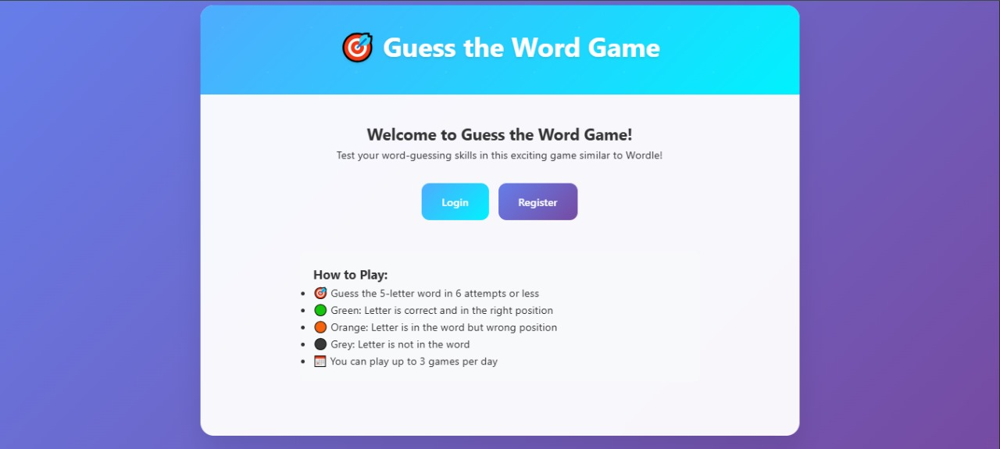
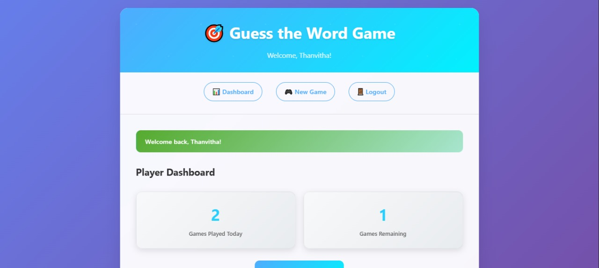
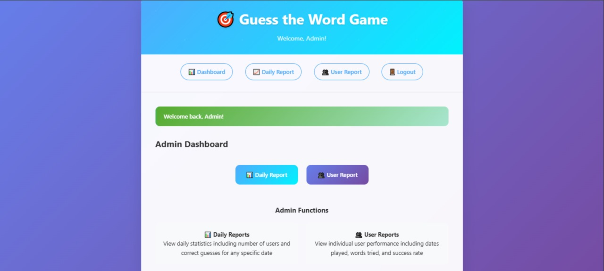
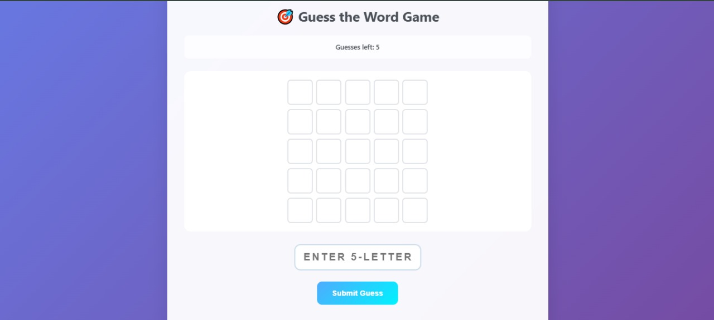

# Guess the Word Game 🎮

A Flask-based word guessing game with user authentication and role-based access control. Players can guess words with limited attempts, while admins can monitor game statistics and user activity.

## 🚀 Features

- **User Authentication**: Secure registration and login system
- **Role-Based Access**:
  - **Admin**: View daily reports, user statistics, and game analytics
  - **Player**: Play up to 3 games per day with 5 guesses per game
- **Interactive Gameplay**: 
  - Random 5-letter word selection
  - Color-coded feedback system (Green: correct position, Orange: wrong position, Grey: not in word)
  - Win/Loss tracking with statistics
- **Comprehensive Reports**:
  - Daily activity summaries
  - Individual user performance tracking
  - Game completion analytics
- **Responsive Design**: Clean, modern UI that works on all devices
- **Error Handling**: Custom error pages for better user experience

## 🛠️ Tech Stack

- **Backend**: Python, Flask
- **Database**: SQLite
- **Frontend**: HTML5, CSS3, JavaScript
- **Styling**: Custom CSS with responsive design
- **Version Control**: Git

## 📁 Project Structure

```
GUESS-WORD-GAME/
├── instance/
│   └── guess-game.db
├── screenshots/
│   ├── admin_page.png
│   ├── game_page.png
│   ├── login.png
│   └── user_page.png
├── static/
│   ├── css/
│   │   └── styles.css
│   └── js/
│       └── game.js
├── templates/
│   ├── admin_dashboard.html
│   ├── base.html
│   ├── daily_report.html
│   ├── error.html
│   ├── game.html
│   ├── index.html
│   ├── login.html
│   ├── player_dashboard.html
│   ├── register.html
│   └── user_report.html
├── .gitignore
├── app.py
├── config.py
├── database.py
├── models.py
├── README.md
└── requirements.txt
```

## ⚙️ Installation & Setup

1. **Clone the repository**:
   ```bash
   git clone https://github.com/YOUR-USERNAME/guess-word-game.git
   cd guess-word-game
   ```


2. **Create virtual environment**:
   ```bash
   python -m venv venv
   
   # On Windows
   venv\Scripts\activate
   
   # On macOS/Linux
   source venv/bin/activate
   ```

3. **Install dependencies**:
   ```bash
   pip install -r requirements.txt
   ```

4. **Initialize database**:
   ```bash
   python database.py
   ```

5. **Run the application**:
   ```bash
   python app.py
   ```

6. **Access the game**:
   Open your browser and go to `http://localhost:5000`

## 🎮 How to Play

### For Players:
1. **Register/Login** with your credentials
2. **Start a new game** from the player dashboard
3. **Guess 5-letter words** using the on-screen keyboard
4. **Interpret feedback**:
   - 🟩 Green: Correct letter in correct position
   - 🟧 Orange: Correct letter in wrong position
   - ⬜ Grey: Letter not in the word
5. **Win** by guessing the word within 5 attempts
6. **Track your progress** with game statistics

### For Admins:
1. **Login** with admin credentials
2. **View daily reports** to see overall game activity
3. **Check user reports** for individual player statistics
4. **Monitor game trends** and user engagement

## 🖼️ Screenshots

### Login Page


### Player Dashboard


### Admin Dashboard


### Game Interface



## 📊 Game Rules

- **Daily Limit**: 3 games per player per day
- **Guesses**: Maximum 5 attempts per game
- **Word Length**: All words are exactly 5 letters
- **Scoring**: Win/loss ratio tracked for each player
- **Reset**: Game limits reset daily at midnight

## 🤝 Contributing

We welcome contributions! Here's how to get started:

1. **Fork the repository**
2. **Clone your fork**:
   ```bash
   git clone https://github.com/Thanvitha-mitta/guess-word-game.git
   cd guess-word-game
   ```
3. **Create a feature branch**:
   ```bash
   git checkout -b feature/amazing-feature
   ```
4. **Make your changes** and test thoroughly
5. **Commit your changes**:
   ```bash
   git add .
   git commit -m "Add amazing feature"
   ```
6. **Push to your branch**:
   ```bash
   git push origin feature/amazing-feature
   ```
7. **Open a Pull Request**

## 🐛 Bug Reports & Feature Requests

Please use GitHub Issues to report bugs or request features. When reporting bugs, include:
- Steps to reproduce
- Expected behavior
- Actual behavior
- Screenshots (if applicable)
- Your environment details


## 👥 Authors

- **Mitta Thanvitha** - *Initial work* - [YourGitHub](https://github.com/Thanvitha-mitta)

## 🙏 Acknowledgments

- Word list sourced from common English dictionary
- Inspiration from Wordle and similar word games
- Flask community for excellent documentation
- Contributors and testers


````

